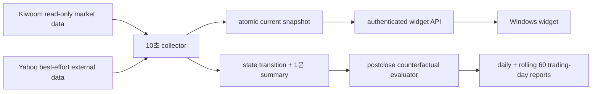

# 삼성전자 전 세션 진입 조언 위젯 외부 감리 설명서

## 1. 문서 목적과 감리 범위

이 문서는 삼성전자(`005930`) Windows 가격 위젯에 추가한 당일 단기매매
진입 조언 로직을 외부 전문가가 독립적으로 검토할 수 있도록 구현 계약,
판정 순서, 데이터 provenance, 안전 경계, 검증 상태와 한계를 정리한다.

- 작성일: 2026-08-02 KST
- 저장소 기준 SHA: `d60c4b0617b0d1bf65da586c42de05e284fa0009`
- 감리 대상: 위 SHA 위의 현재 Samsung widget advisory working-tree diff
- 판단 권한: `widget_advisory_only`
- runtime 영향: `runtime_effect=false`
- 명시적 금지: 주문·계좌·수량·토큰 발급/갱신·매매 봇 제어·AI 점수/하드게이트
- 감리 제외: 매도 신호, 손절 주문, 주문 수량, 자동 매매 성과

이 로직은 투자자에게 상태와 가격 범위를 보여주는 읽기 전용 보조 도구다.
실주문 SCALPING runtime이나 기존 전략의 진입·청산 판단에는 연결되지 않는다.

## 2. 구성과 데이터 흐름



구현 소유 경계는 다음과 같다.

| 역할 | 파일 |
|---|---|
| 세션·권한·snapshot 계약 | `src/engine/monitoring/samsung_widget_contract.py` |
| 읽기 전용 수집·feature·상태기계 | `src/engine/monitoring/samsung_widget_advisory.py` |
| MFE/MAE·first-hit 관측 | `src/engine/monitoring/samsung_widget_advisory_evaluation.py` |
| 인증 API·안전 fallback | `src/web/samsung_price_widget_routes.py` |
| Windows 표시·계약 검증 | `tools/windows/samsung_price_widget.py` |
| 배포 정의 | `deploy/systemd/korstockscan-samsung-widget-*` |

## 3. 권한 격리와 fail-closed 계약

수집기는 AWS에 이미 생성된 Kiwoom bearer token cache만 읽는다. 토큰이 없으면
`shared_token_unavailable`로 실패하며 발급, 갱신, 취소 또는 외부 전송을 하지
않는다. Kiwoom 호출은 코드의 `READ_ONLY_KIWOOM_REQUESTS` allowlist에 있는 시장
데이터 TR만 허용하며 allowlist 밖 요청은 네트워크 호출 전에 거부한다.

모든 조언 payload에는 아래 네 필드가 고정된다.

```json
{
  "authority": "widget_advisory_only",
  "runtime_effect": false,
  "actual_order_submitted": false,
  "broker_order_forbidden": true
}
```

API는 fresh collector snapshot에 이 계약이 없거나 값이 다르면 snapshot을
폐기한다. Windows client도 같은 계약을 재검증한다. 이중 검증을 통과하지 못한
조언은 화면에 진입 상태로 표시하지 않는다.

## 4. 세션 계약

| 세션 | KST 시간 | venue/cohort | 종목코드 | 최소 확정 1분봉 |
|---|---:|---|---|---:|
| `NXT_PREMARKET` | 08:00~08:50 | NXT / `PREMARKET_KRX_LIKE` | `005930_NX` | 10 |
| `SESSION_TRANSITION` | 08:50~09:00 | 비활성 | - | - |
| `KRX_REGULAR` | 09:00~15:30 | KRX / KRX | `005930` | 3 |
| `SESSION_TRANSITION` | 15:30~15:40 | 비활성 | - | - |
| `NXT_AFTERMARKET` | 15:40~20:00 | NXT / NXT | `005930_NX` | 5 |

주말과 한국 휴장일, 전환 구간, 20:00 이후에는 조언을 생성하지 않는다. 최소
관측 구간 전에는 현재가만 유지하고 상태는 `DATA_WAIT`다. 승격 확인 streak는
`거래일+세션`별로 초기화되어 KRX 확인 이력이 NXT나 다음 거래일로 이월되지
않는다. 두 확인의 간격이 25초를 넘거나 collector cycle이 실패하면 streak를
초기화한다. 첫 번째 확인은 `raw_state` provenance만 남기고 화면 상태는
`WATCH`, 권장가격은 미표시 상태로 유지한다.

프리마켓 context는 정규장 09:30 전까지만 약세 여부를 확인하는 보조 근거다.
정규장 신호를 새로 만들 수 없고 `ENTRY_READY`를 `ENTRY_CAUTION`으로만 낮출 수
있다. 애프터마켓 외국인·프로그램 값은 마지막 KRX 값을
`FROZEN_REGULAR_SESSION`, `live_for_current_session=false`로 표시한다. 장후 가격
anchor는 전일 OHLC가 아니라 당일 KRX 확정봉의 OHLC/VWAP를 별도
`session_anchor`로 복원하며, NXT 자체 구조적 지지와 혼합하지 않는다.
collector가 장후에 재기동된 경우에는 당일 KRX 종료시각 이하의 외국인·프로그램
원천이 모두 있는 경우에만 historical 응답을 frozen provenance로 복원한다.

## 5. 입력 원천과 호출 주기

| 주기 | 원천 | 용도 | 실패 처리 |
|---:|---|---|---|
| 10초 | `ka10001` | 삼성 현재가·당일 저가 | 필수, cycle 실패 |
| 10초 | `ka10004` | 최우선 bid/ask·잔량 | 필수, `DATA_WAIT` |
| 10초 | `ka10003` | 최신 3체결 하락 veto | 선택, 개별 gap |
| 확정 분 변경 | `ka10080` | 삼성·SK하이닉스 세션 1분 OHLCV | 삼성 필수, peer 선택 |
| 확정 분 변경 | `ka20005` | KRX KOSPI 업종 1분 OHLCV | 선택, 동일 시간창 약세 veto |
| 30초 | `ka10001`, `ka20001` | SK하이닉스·KOSPI 전일종가 대비 상대강도 | 선택, 조건 미충족/제한 |
| 60초 | `ka10064`, `ka90008` | 외국인·프로그램 비악화 여부 | 선택, 최대 caution |
| 일 1회 성공 시 | `ka10081` | 전일 OHLC anchor | 필수, `DATA_WAIT` |
| 60초 | Yahoo `NQ=F`, `MU`, `KRW=X` | 외부 위험 | 선택, 최대 caution |

Yahoo 세 원천은 각각 최대 5초 timeout을 두고 병렬 격리한다. 한 원천의 예외는
그 원천만 `UNAVAILABLE`로 만들며 다른 원천을 폐기하지 않는다. Yahoo 값은 항상
`yahoo_best_effort`와 `BEST_EFFORT_DELAYED`로 표시하고 라이선스 실시간 시세로
표현하지 않는다.

collector는 별도의 프로세스 로컬 36 calls/minute budget을 사용하며 선택 TR은
필수 quote/BBO용 2-call reserve를 침범하지 못한다. HTTP 429를 받으면 collector
자체만 30초 cooldown하고 실매매 봇 limiter나 provider 상태는 변경하지 않는다.
snapshot에는 cycle elapsed/request count/budget 잔량/429 count를 기록한다.
systemd unit은 `Nice=10`, `CPUQuota=20%`, `MemoryMax=512M`, `TasksMax=64`와 낮은
I/O priority를 사용한다. 이는 프로세스 자원 격리이며 계정 단위 API quota의
물리적 우선권을 보장한다는 뜻은 아니다.

공식 Kiwoom reference gate는 2026-08-02T22:53:30+09:00에 upstream commit
`69642586f7d84ba9fd8a6faf1f1537c7fda6568b`를 기준으로 확인했다. 확인 경로는
`kiwoom_docs/종목정보.md`, `시세.md`, `차트.md`, `업종.md`,
`kiwoom/_data/kiwoom_api_spec.json`, `kiwoom/specs.py`,
`kiwoom/core/client.py`, Postman collection 및 로컬
`docs/kiwoom-api-data-contract.md`다.
코드리뷰 보완 후 2026-08-02T23:33:47+09:00 및 외부감리 보완
2026-08-02T23:54:52+09:00에 upstream `main`이 같은 SHA임을
재확인하고, `ka10081`의 `base_dt`, `stk_dt_pole_chart_qry`, `dt`, `cur_prc`,
`open_pric`, `high_pric`, `low_pric` 계약을 다시 대조했다.
가격추세 보완 시 2026-08-03T00:04:04+09:00에 같은 SHA를 재확인하고
`ka20005`의 `POST /api/dostk/chart`, `api-id=ka20005`, `inds_cd=001`,
`tic_scope=1`, `inds_min_pole_qry`, 지수값 100배 정수와 `cntr_tm` 계약을 대조했다.

## 6. freshness와 source quality

필수 입력의 판정은 단순 WS/REST stale 플래그가 아니라 다음 receive-time
envelope를 사용한다.

- quote: REST 응답 수신 후 20초 이내
- BBO: REST 응답 수신 후 20초 이내
- quote-BBO coherence: 현재가가 `best_bid-1tick`과 `best_ask+1tick` 사이
- 확정 1분봉: KRX 120초, NXT 세션 180초 이내
- 전일 OHLC: 현재 거래일에 성공적으로 갱신한 daily 응답 안의 직전 한국
  거래일 유효 행
- API snapshot: timezone이 명시된 `observed_at_kst`, 25초 이내
- 외부시장: 원시 관측시각 기준 300초 초과 시 `STALE`
- KRX 외국인·프로그램: 두 원천 시각을 독립 계산하고 둘 다 300초 이내일 때만
  `OBSERVED`; 하나라도 늦으면 `STALE`, 결손이면 `PARTIAL|UNAVAILABLE`

`ka10004.bid_req_base_tm`은 의미가 불충분하므로 freshness authority로 쓰지 않고
raw provenance로만 보존한다. 필수 quote/BBO/분봉/전일 anchor 결손은
`source_quality.status=BLOCKED`와 `DATA_WAIT`를 만든다. 상대강도·수급·외부시장
같은 보조 입력 결손은 국내 조건을 우회하지 않으며 최대 `ENTRY_CAUTION`까지만
허용한다.

collector snapshot이 없거나 stale이면 API는 `ka10001` 한 번만 호출해 현재가를
보여주고 중첩 조언을 canonical 세션의 `DATA_WAIT`로 반환한다. 부분 데이터로
`ENTRY_READY`를 합성하지 않는다. API는 outer snapshot 시각과 inner advisory
시각의 일치, 현재 요청시각 기준 `valid_until`, actionable 상태의 PASS
source-quality 및 완전한 권장가격 범위를 별도로 확인한다.

## 7. 동적 feature와 계산식

고정 가격대는 사용하지 않는다. 매일과 매 세션 아래 값을 다시 계산한다.

### 7.1 가격 구조

- 세션 VWAP proxy: 거래량이 있는 확정봉의
  `sum(((high+low+close)/3)*volume)/sum(volume)`
- 거래량이 전부 0이면 확정봉 HLC3 단순평균을 제한적 fallback으로 사용한다.
  Kiwoom 분봉에서 실제 거래대금 원천이 없는 경우이므로 provenance에는
  `hlc3_volume_weighted_with_hlc3_fallback`을 기록한다.
- opening range: 세션 최소 관측 봉 구간의 고가·저가(현재는 provenance/표시)
- pivot support: 최근 12봉에서 양 옆보다 낮거나 같은 확정 저점
- 상승 구조: 이전 3봉 대비 최근 3봉의 저점이 높거나 같고 고점이 더 높음
- 재시험 유지: 두 번째 pivot 저점이 첫 저점의 0.1% 또는 1틱 허용 범위 안에서
  무너지지 않고 최신 확정 종가가 두 번째 저점 위에 있음
- 최근 저항: 최신 2봉을 제외한 최근 구간의 최고가

진입 구조는 `저점 재시험 유지 OR 고점·저점 동반 상승` 중 하나를 요구한다.
단순 higher-low 하나만으로는 통과시키지 않는다.

### 7.2 거래량·추세·상대강도

- 최근 8봉 상승봉 평균 거래량이 하락봉 평균 이상이어야 한다.
- 최근 8봉에 상승봉 2개 이상, 하락봉 1개 이상이 있고 0거래량 봉 비율이 25%
  이하여야 한다. 한 방향 표본만 있는 경우에는 평균 비교를 통과시키지 않는다.
- 두 pivot 재시험이 있으면 두 번째 저점 봉 거래량이 첫 번째 이하이어야 한다.
- 예외적으로 두 번째 저점 거래량이 증가했더라도 retest 지지가 유지되고 상승봉이
  3개 이상 누적된 뒤 최신 확정봉 종가가 세션 VWAP과 직전 저항을 모두 회복했으며 3·5분
  추세가 하락이 아니면 `absorption_recovery`로 통과시킨다. 대량 매도 흡수 후
  회복을 단순 거래량 증가 실패로 오분류하지 않기 위한 경로이며 단독 승격은 아니다.
- 1·3·5분 확정봉 추세의 중립 band는 고정 5bp가 아니라
  `max(세션·시간창 tick multiplier, 최근 12봉 절대변화 중앙값*1.25)`를 유효
  tick으로 올림해 사용한다. KRX multiplier는 `1/2/3틱`, NXT 프리·애프터는
  `2/3/4틱`이다. band 경계 이내는 `flat`이다.
- `up/down`은 net change가 band를 넘어야 하고 회귀 slope 방향, `R²>=0.40`,
  방향 일치율 `>=0.60`을 모두 만족해야 한다. 3분·5분 중 하나라도 `down`이면
  core를 통과하지 않는다. 이는 미래 가격 예측이 아니라 최근 확정봉 상태다.
- 화면·API는 `TREND_UP`, `TREND_STABLE`, `TREND_MIXED`, `TREND_DOWN`,
  `TREND_DATA_WAIT`를 진입 setup 상태와 분리한다. `flat+flat`은 조건에 따라
  setup이 될 수 있지만 `TREND_UP`으로 표시하지 않는다.
- KRX에서는 삼성전자·SK하이닉스·KOSPI 세 값이 모두 필요하고, 삼성전자가 두
  비교대상 중 하나보다 0.5%p 이상 약하면 통과하지 않는다. NXT에서는 KOSPI를
  실시간처럼 사용하지 않고 삼성전자와 NXT SK하이닉스만 비교한다.
- 전일종가 대비 비교에 더해 확정 1분봉 timestamp를 정확히 맞춘 3·5·15분
  삼성-SK하이닉스, KRX 삼성-KOSPI 수익률 차를 계산한다. 가장 긴 가용 시간창에서
  `-0.5%p` 미만이면 추가 약세 veto로만 사용한다. 동일 시간창 결측은 새 positive
  authority도 새 hard block도 만들지 않는다.
- 전일종가 대비 상대약세가 있더라도 두 비교대상의 15분·5분 동일 시간창이 모두
  존재하고 각각 `-0.5%p` 이상이면 누적 약세 block만 해제한다. 이는 진입 승격이
  아니라 영구 block 해제이며, 구조·VWAP·거래량·추세·호가 조건은 별도로 통과해야
  한다. 어느 시간창이든 결측 또는 `-0.5%p` 미만이면 해제하지 않는다.
- KRX 외국인 2시점과 프로그램 값이 모두 있어야 수급을 `OBSERVED`로 표시한다.
  두 흐름이 모두 비악화여야 ready를 유지하며, 어느 한쪽이라도 악화되면
  caution으로 낮춘다. 한쪽만 있는 `PARTIAL`이나 전체 결측도 caution이다.
- 최신 3체결이 newest-first 기준 연속 하락이면 positive authority를 만들지 않고
  `WATCH`로 낮춘다.
- 현재가가 마지막 확정봉 종가보다 동적 1분 band 이상 낮고 매도1호가 잔량이
  매수1호가의 1.5배 이상이면 `live_price_reversal_with_ask_pressure`로 즉시
  `WATCH` 강등한다. 현재가 상승 impulse는 상향 신호로 사용하지 않는다.

### 7.3 support, trigger, 추천가격

세 가격 역할을 분리한다. `structural_support`는 최근 확정 pivot/retest 구조만,
`tactical_support`는 현재가 이하 structural support와 세션 VWAP 중 높은 값,
`session_anchor`는 프리/정규/장후 비교용 전일 또는 당일 KRX OHLC/VWAP다.
anchor는 `AVOID`나 추천가격의 직접 support로 승격되지 않는다.
단일 pivot이나 허용오차 아래로 무너진 두 번째 저점은 `candidate_support`로만
기록하며 `structural_support`로 승격하지 않는다. 이때 상태는 source 결손을 뜻하는
`DATA_WAIT`가 아니라 구조 확인 전인 `WATCH`이고 추천가격은 생성하지 않는다.
두 pivot은 최소 한 봉 이상 떨어지고 그 사이 가격이 1틱 이상 반등해야 retest로
인정한다. 단순 동일저가 plateau의 인접 pivot은 지지 재시험으로 확정하지 않는다.

```text
candidate_support = latest pivot or 3+3 structure low (observation only)
structural_support = tick_floor(retest-held or higher-high-and-low support)
tactical_support = tick_floor(max(structural_support, session VWAP <= current))
invalidation = structural_support - 1 exchange tick
trigger = tick_floor(max(reclaimed VWAP, recent resistance, prior close))
entry_low = max(tactical_support, best_bid)
entry_high = min(best_ask, tactical_support + 2 exchange ticks)
```

가격대 경계에서 tick size가 바뀌는 경우에도 `move_price_by_ticks`로 실제 tick을
하나씩 계산한다. `structural_support`는 무효화와 하락위험 거리를 소유하고,
추격 여부는 실제 권장가격 owner인 `tactical_support`와의 거리만 사용한다.
현재가가 tactical support보다 0.3%를 넘으면 `NO_CHASE`다. 현재가가
structural support보다 낮거나 invalidation과 같거나
낮으면 즉시 `AVOID`다. 추천 범위가
역전되면 역시 `NO_CHASE`다. 권장가격은 자동 주문가격이 아니다.

## 8. 외부시장 risk adapter

원시 시각 기준으로 실제 15분 이전 관측값이 있을 때만 변화율을 계산한다. 15분
이력이 없으면 행 개수로 대체하지 않고 `UNAVAILABLE`이다. 초기 기준은 NQ
`-0.40%`, MU `-0.80%`, USD/KRW `+0.25%`다.

- 한 원천 악화: `CAUTION`
- 한 원천이 기준의 2배 이상 악화 또는 두 원천 동시 악화: `HOLD`
- 5분 초과 지연·결측: `DATA_LIMITED`
- MU extended market 시간 밖, 주말 또는 NYSE 휴장일: `MARKET_CLOSED`,
  stale/adverse에서 제외

`HOLD`는 국내 core가 통과해도 가격 범위를 제거하고 `WATCH`로 낮춘다. 외부시장
호조는 어떤 경우에도 국내 core 실패를 통과시키거나 `ENTRY_READY`를 생성하지
않는다.

## 9. 상태기계와 전이 우선순위

| 우선순위 | 조건 | 결과 |
|---:|---|---|
| 1 | 필수 source-quality 차단 | `DATA_WAIT` |
| 2 | confirmed support 미생성 | `WATCH`, 후보 support만 관측 |
| 3 | confirmed support 하향 이탈 | `AVOID` |
| 4 | 최신 체결 하락 또는 실시간 반전 veto | `WATCH` |
| 5 | 국내 6개 core 중 하나 실패 | `WATCH`, 최초 blocker 표시 |
| 6 | 국내 6개 core 통과 후 tactical support 대비 0.3% 초과 추격 | `NO_CHASE` |
| 7 | 국내 core 통과 + 외부 `HOLD` | `WATCH`, 가격범위 제거 |
| 8 | 국내 core 통과 + 보조 risk/gap | `ENTRY_CAUTION` |
| 9 | 국내 core 통과 + 보조 위험 없음 | `ENTRY_READY` |

국내 6개 core는 구조, VWAP/저항 회복, 거래량, 3·5분 추세, 상대강도, 2틱 이내
spread다. `ENTRY_CAUTION`과 `ENTRY_READY`로의 상향 전이는 같은 거래일·세션의
연속 10초 관측 2회가 필요하다. stale, support 이탈, spread 악화와 다른 강등은
즉시 적용한다.

모든 조언은 60초, 현재 세션 종료, 당일 20:00 중 가장 이른 시각에 만료된다.
Windows 화면은 비진입 상태에 빈 문자열 대신 `가격대기`, `범위이탈`, `범위없음`을
표시한다. 이는 권장가격을 합성하는 대체 경로가 아니라 가격 미생성 사유 표시다.

## 10. API·화면 계약

기존 top-level 현재가·당일저가·1/3/5분 추세·20분 chart 필드는 유지한다. 새
중첩 `advisory`에는 다음을 추가한다.

- `state`, `raw_state`, canonical `session`
- `entry_price_low/high`, `trigger_price`, `invalidation_price`
- `reasons`, `unmet_conditions`, `valid_until`
- `source_quality`, `external_risk`, `external_points`, `provenance`
- `trend_assessment`, `trend_details`, `live_reversal`, `relative_strength`,
  `relative_assessment`
- `derived`, `flow`, authority 안전 필드, `metric_contract`

Windows 창은 팝업·소리 없이 `상태 · 권장가격`, 확정봉 추세, 핵심 근거, 외부 위험/지연을
압축 표시하며 항상 `관측용/자동주문 아님`을 표시한다. API enum은 유지하되
`ENTRY_READY`는 `조건충족(관측)`, `ENTRY_CAUTION`은 `조건부분(관측)`으로 보인다.
음수나 0인 권장가격, 미등록 상태값, authority 위반 payload는
client parser가 거부한다. actionable이 아닌 상태의 권장가격 또는 actionable
상태의 불완전한 권장가격 범위도 계약 오류로 거부한다.

client는 outer/inner observed time, `valid_until`, canonical session/venue/cohort를
재검증한다. 네트워크 오류는 이전 가격만 남기고 조언은 즉시 `DATA_WAIT`로
지운다. 마지막 성공 후 25초가 지나면 1초 watchdog이 색상과 추천범위를 제거하고
마지막 성공 경과시간을 표시한다.

## 11. 관측·평가 계약

10초 raw payload 전부를 저장하지 않는다. 상태 전환과 분당 한 요약만 JSONL에
기록하고 30일이 지난 JSONL은 삭제한다. 상태 전환 시점의 추천 범위가 실제로
현재가 표본에 닿은 경우만 `ENTRY_TOUCHED`, 확정봉 고저로만 닿은 경우는
`ENTRY_AMBIGUOUS`, 끝내 닿지 않으면 `NOT_TOUCHED`로 분리한다. MFE/MAE 시계는
`ENTRY_TOUCHED` 시각 이후에만 시작하며 동일 세션·동일 venue의 미래 관측으로
1·3·5·10·20·30·60분 MFE/MAE를 계산한다. entry reference는 추천 범위 상단을
우선 사용하고, 상단이 없으면 하단, 그것도 없으면 관측 현재가를 사용한다.

- target: entry reference +0.5%, tick 올림
- adverse: 동적 invalidation, 없으면 -0.3% tick 내림
- 같은 확정봉에서 target/adverse가 모두 닿으면
  `same_observation_ambiguous`
- 신호가 생성된 미완성 분봉은 미래 성과에 재사용하지 않음
- horizon별 expected/observed minute, coverage ratio, missing count, max gap을
  기록하고 coverage 80% 미만 또는 max gap 120초 초과는 성과 집계에서 제외
- 실현손익과 합산하지 않음
- 60거래일 전에는 threshold 품질 판정이나 자동 승격에 사용하지 않음
- `state_transition`/metric/provenance/authority/runtime/source-quality/시각/
  session/venue/권장가격 계약이 어긋난 actionable 행은 성과 표본에서 제외하고
  이유별 count를 남김

rolling 60일 floor는 파일 개수가 아니라 KRX 휴장일을 제외하고 세션별 80%
coverage를 모두 충족한 `qualified_trading_day_count`에만 적용한다. coverage의
observed minute은 advisory source quality가 `PASS`인 분만 세며 전체 관측 분은
별도 `total_observed_minute_count`로 남긴다.

평가 timer의 기본 target date는 20:00 이후 정상 실행이면 당일, `Persistent`
timer가 다음 거래일 20:00 전에 지연 실행되면 직전 한국 거래일이다. 지연 실행이
오늘 생성 중인 파일을 미완성 일일 성과로 오인하지 않는다. 기본 `--write`는
관측 JSONL은 있으나 일일 report가 없는 과거 날짜를 모두 찾아 먼저 backfill한
뒤 rolling을 재생성한다.

기존 real/sim 로그는 같은 세션의 확정 OHLCV, BBO, venue, exact advisory payload를
동시에 복원할 수 없으므로 이 상태기계의 historical replay에 억지로 정규화하지
않는다. 현재 구현 이후의 compact observation이 평가 기준 원천이다.

## 12. 이번 코드리뷰에서 발견·보완한 결함

| 결함 | 위험 | 보완 |
|---|---|---|
| tick band 경계에서 단일 tick spread를 0으로 계산 | spread guard 오판 | 실제 가격 tick을 순회해 계산 |
| higher-low만으로 구조 통과 가능 | 요구보다 느슨한 진입 상태 | 고점·저점 동반 상승 또는 retest 유지로 제한 |
| promotion streak가 세션/일자를 횡단 | 새 세션 첫 관측 즉시 승격 | 거래일+세션 scope로 초기화 |
| 프리마켓/장후 수급 복구 일시 실패 후 당일 재시도 없음 | 하루 종일 보조 provenance 결손 | 성공 전 60초 bounded retry |
| Yahoo 3원천 순차 timeout | 10초 갱신 budget 지연 | 3 worker 병렬·원천별 예외 격리 |
| fallback 중첩 세션이 legacy 명칭 | API consumer 계약 불일치 | canonical 세션으로 통일 |
| timezone 없는 snapshot 시각 허용 | host timezone 의존 freshness | timezone 명시 없으면 폐기 |
| 음수 권장가격을 client에서 절댓값 변환 | server 결함 은폐 | 명시적 계약 오류로 거부 |
| KRX 신호의 장기 horizon에 NXT 가격 혼입 가능 | venue별 성과 왜곡 | 미래 window·성숙도를 동일 session+venue로 제한 |
| 전일 daily cache를 다음 날 재사용 가능 | 불완전 장중봉을 전일 anchor로 오인 | 현재 거래일 갱신 cache만 허용 |
| 전일 KRX 수급 cache가 장후까지 남을 가능성 | NXT에서 전일 수급을 당일 frozen 값으로 오인 | 관측일 불일치 cache 즉시 폐기 |
| collector 재기동이 확인 streak·상태기록을 초기화 | 일시 강등과 중복 actionable 표본 | fresh 동일 세션 snapshot과 당일 마지막 compact 상태만 복원 |
| `WATCH` 화면이 blocker보다 통과 사유를 먼저 표시 | 사용자가 차단 원인을 오해 | 대기/관찰 상태는 unmet condition을 우선 표시 |
| 첫 확인 `WATCH`에 권장가격이 노출 | 2회 확인 전 사실상 진입가격 제시 | 첫 actionable 확인은 가격범위를 제거하고 두 번째 연속 확인 후 표시 |
| 실패 cycle을 사이에 둔 확인 streak 유지 | 비연속 표본으로 잘못 승격 | 실패 또는 25초 초과 간격에서 streak와 visible state 초기화 |
| fresh outer snapshot에 stale/expired inner advisory 결합 가능 | 만료 조언 재노출 | outer/inner 시각, 현재 `valid_until`, source-quality와 가격범위 계약 검증 |
| 장후 재기동 시 KRX flow가 age 초과로 복원되지 않음 | frozen provenance 상실 | 당일 KRX 종료 이하의 완전한 historical flow만 frozen으로 복원 |
| evaluator가 authority/source-quality 결손 신호를 수용 | 관측 성과 표본 오염 | 결손 actionable 행 제외 및 이유별 source-quality count 기록 |
| Persistent timer 지연 실행이 현재 날짜를 무조건 선택 | 장중 미성숙 파일 평가 | 20:00 전 지연 실행은 직전 한국 거래일을 선택 |
| Windows 통신 실패 시 이전 ENTRY 상태 잔류 | 만료 조언을 현재 신호로 오인 | 오류 즉시 조언 제거 + 25초 local watchdog |
| 전일저가·VWAP·pivot을 단일 support로 혼합 | AVOID/NO_CHASE 의미 왜곡 | structural/tactical/session-anchor 역할 분리 |
| invalidation 경계값에서 AVOID 미적용 | 정확한 지지 이탈값에 진입 가능 | `current <= invalidation` 및 structural 하회 즉시 AVOID |
| 외국인·프로그램 최신시각을 max로 합침 | 한 원천 stale 은폐 | 원천별 age 계산 후 둘 다 fresh일 때만 OBSERVED |
| 한 방향 1개 봉으로 거래량 확인 통과 | 희박 표본 과신 | 방향별 최소 표본과 zero-volume 비율 도입 |
| 신호 발생을 체결로 가정한 MFE | 미체결 신호 성과 과대평가 | touch/ambiguous/not-touched 및 coverage-qualified 평가 |

## 13. 검증 증거

현재 대상 테스트 104건이 통과했다.

```text
PYTHONPATH=. .venv/bin/pytest -q \
  src/tests/test_samsung_widget_advisory.py \
  src/tests/test_samsung_widget_advisory_evaluation.py \
  src/tests/test_samsung_price_widget_routes.py \
  src/tests/test_samsung_price_widget_client.py

104 passed
```

검증 범위에는 세션 전환, 확정봉 격리, 추세·구조, 2회 확인, 세션 scope reset,
동적 가격·추격 방지, price-band tick, BBO/quote stale, 외부 위험/휴장/결측,
premarket auxiliary, frozen flow, cached-token-only, read-only allowlist, API fallback,
Windows authority validation, 평가 anti-lookahead와 rolling 60일 floor가 포함된다.
추가로 실패/시간 간격 streak reset, 미확인 가격범위 차단, outer/inner snapshot
시각·만료 검증, 장후 frozen flow 복원, evaluator source-contract 제외 및
Persistent timer target-date 선택을 검증한다.

## 14. 알려진 한계와 외부 감리 요청사항

다음은 결함으로 은폐하지 않고 감리 판단을 요청하는 초기 가정이다.

1. 국내 데이터도 전용 WS가 아닌 REST polling이므로 10초 갱신이며 초단위 체결
   전체를 재구성하지 않는다.
2. Yahoo는 공식 실시간 feed가 아니다. 공급자 교체 전에는 NQ/MU/FX 지연 품질을
   매매용 실시간 risk로 간주할 수 없다.
3. VWAP는 실제 거래대금/거래량이 아니라 분봉 HLC3·거래량 proxy다. 실제 거래대금
   원천을 안전하게 확보하기 전에는 정밀 체결 VWAP로 표현하지 않는다.
4. opening range와 전일 고가는 provenance로 산출되지만 현재 hard core gate는
   아니다. 추가 gate 필요 여부는 60일 관측 전 자동 변경하지 않는다.
5. 상대강도 0.5%p, chase 0.3%, 외부 15분 threshold, target 0.5%는 초기 bounded
   가정이다. 현 시점에 통계적 우월성이 입증된 calibration 값이 아니다.
6. 외국인·프로그램 장중 집계의 수정·지연 가능성이 있어 가격반응과 분리된
   positive authority로 사용하지 않는다.
7. 추천가격은 체결 가능성, 슬리피지, 주문 latency, 수수료·세금을 최적화하지
   않는다. 이번 범위는 advisory이며 execution engine이 아니다.
8. 구현 이후 60거래일 표본이 아직 누적되지 않았다. 현재 판정은 로직·계약
   검증이지 수익성 검증이 아니다.
9. 한국 공휴일 라이브러리에 없는 임시 KRX 휴장일에는 전일 anchor를 추측하지
   않고 `DATA_WAIT`로 닫는다. 별도 공식 거래 캘린더가 연결되기 전의 보수적 한계다.
10. `bid_req_base_tm` 의미가 공식 계약상 충분히 정의되지 않아 source-time hard
    freshness에는 쓰지 않는다. completed-bar age, REST receive-time, quote-BBO
    coherence로 제한하며 VI·거래정지·무체결 상태의 완전한 구분은 후속 source
    contract가 필요하다.
11. collector의 프로세스 자원과 로컬 요청 budget은 격리했지만 Kiwoom 계정
    전체의 cross-process quota owner는 없다. 장전에는 bot latency/429와 collector
    budget provenance를 함께 확인해야 한다.

외부 감리자는 특히 아래를 독립 검토해야 한다.

- Kiwoom NXT/KRX request code와 각 TR 필드의 venue 의미가 실제 응답과 일치하는가?
- REST receive-time freshness envelope 20초와 분봉 120/180초가 보수적으로 충분한가?
- structural/tactical/session-anchor 분리가 하락장에서 잘못된 가까운 support를
  만들지 않는가?
- retest tolerance `max(1틱, 0.1%)`와 3+3봉 구조가 삼성전자 변동성에 적합한가?
- 외부 위험 threshold와 MU extended-hours calendar/휴장 처리가 충분한가?
- 60일 관측 보고서가 state/session/venue별 표본 수와 first-hit ambiguity를 올바르게
  분리하는가?
- 화면 표현이 투자 조언의 확실성을 과장하지 않고 `관측 전용`임을 충분히
  전달하는가?

## 15. 배포·rollback 경계

이 문서 작성 및 리뷰 과정에서는 trading bot을 재기동하지 않았다. collector와
evaluator systemd 설치, Gunicorn의 새 API 코드 반영 여부는 별도의 운영 확인
대상이다.

rollback은 Samsung widget collector/timer만 중지하고 API가 quote-only
`DATA_WAIT` fallback을 사용하게 하는 방식이다. 실매매 봇, provider route,
threshold, 주문·계좌 상태를 변경할 필요가 없다.
